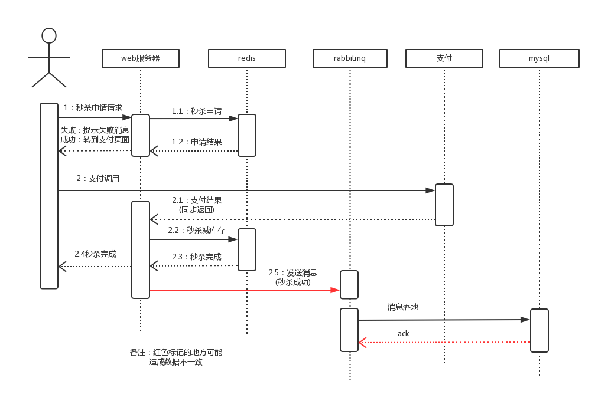

## 项目介绍
seckill是高并发下的秒杀功能的后台实现。其特点是在高并发下的快速响应。

秒杀业务的核心流程是：减库存、添加订单信息。这两个操作是原子性的执行，一般基于mysql的事务来实现。但在高并发场景下会出现性能瓶颈：

* mysql数据库的连接数是有限的，默认为100。连接数不够时其余的请求线程都会堵塞；
* 并发减库存的update操作与添加订单的insert操作都会进行一次当前读操作而加锁(X锁)，
没有获得锁的线程都会堵塞；

### 项目设计
为了解决高并发下出现的上述两个问题，需要将mysql的操作异步化。seckill采用基于缓存 + 消息队列方式实现。

### 秒杀时序图(未成功加载见doc/seckill.png)

## Seckill的性能优化
### 连接池(db、rabbitmq、redis)
- 通过连接池来管理连接的创建与释放，可节省创建连接的时间。初始化时创建的线程数量也不能太多，避免大量的连接因空闲时间过久而自动断开以及过多的连接检查。

### spring TransactionSynchronizationManager(db、rabbitmq、redis)
- 通过TransactionSynchronizationManager来缓存连接，manager可避免单线程内的每次操作都从连接池获取释放连接，减轻连接池的压力。

### protostuff(redis与rabbitmq都采用protostuff序列化对象)
- protostuff基于Google protobuf，protobuf是所有序列化技术中速度最快的，而且占用空间小。(protostuff与protobuf性能差不多)

## 超卖问题
